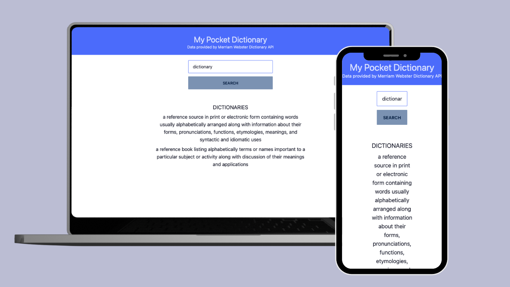

# Dictionary
A minimal dictionary application using the Merriam Webster Dictionary API which can be found here: https://dictionaryapi.com/products/api-collegiate-dictionary

## How It's Made
Tech: HTML, CSS, JavaScript

API calls were gathered using the fetch API and data parsed using Javascript. Font style is Special Elite taken from Google Fonts

## Optimizations
Deeply embedded data was stored in variables for easy access

-- Future Implementations
    - Audio pronounciation guide
    - functionality to handle user typos

## Lessons Learned
Some APIs have a lot of data and it can become cumbersome to search for specifics. Always read API documentation and implement easy to read variables in your code for future readability